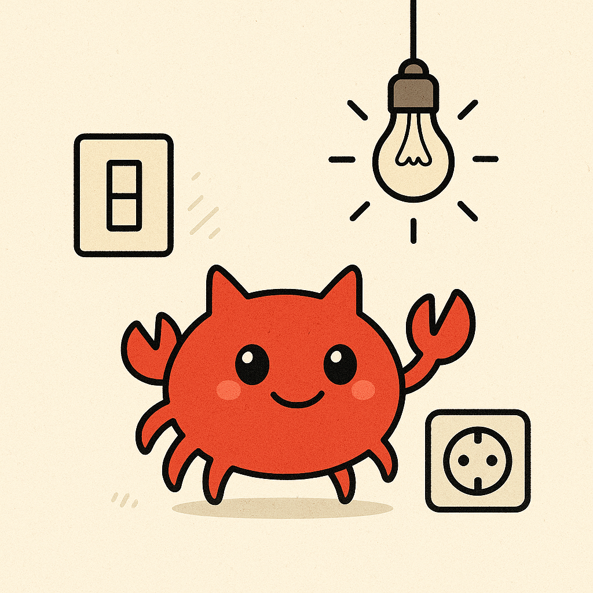

# smart_helper

  

<p>
  
</p>

🔍 Простая утилита командной строки на Rust для поиска устройств по описанию в конфигурационном файле.

Этот проект создан в образовательных целях для сайта https://eagle2001.space/ — чтобы на практике изучить:

- работу с аргументами командной строки (`std::env::args`)
- чтение файла построчно с помощью `BufReader`
- разбор структурированного текста без внешних зависимостей
- базовую фильтрацию по строкам
- организацию CLI-утилит на Rust

---

## 🚀 Как запустить

1. Клонируйте репозиторий (или создайте проект через `cargo new`)
2. Поместите файл `devices.txt` в корень проекта или используйте существующий
3. Запустите:

```bash
cargo run -- devices.txt ламп
```

## 📌 Зависимости
📦 Только стандартная библиотека (`std`). Никаких внешних `crates` - это осознанное решение для лучшего понимания базовых конструкций.

## 📚 Цель
Проект - часть обучающей серии по языку Rust. Если ты хочешь разобраться в:
- системной работе со строками
- минимальных CLI-интерфейсах
- безопасной обработке данных

этот код подойдёт как стартовая точка.

## 🖥️ Пример использования

```bash
$ cargo run -- devices.txt лампочка
```

```yaml
🔍 Найдено совпадений 1:

🔶  Название: Умная лампочка Philips Hue RGB
🔶  ID: light_hue_rgb_01
🔶  Местоположение: Гостиная
🔶  Серийный номер: PH-HUE-01
🔶  Возможности: диммируемая, цветная
```


## 🦀 Автор
Этот репозиторий создан в рамках серии Rust-статей на https://eagle2001.space.

Лицензия: MIT